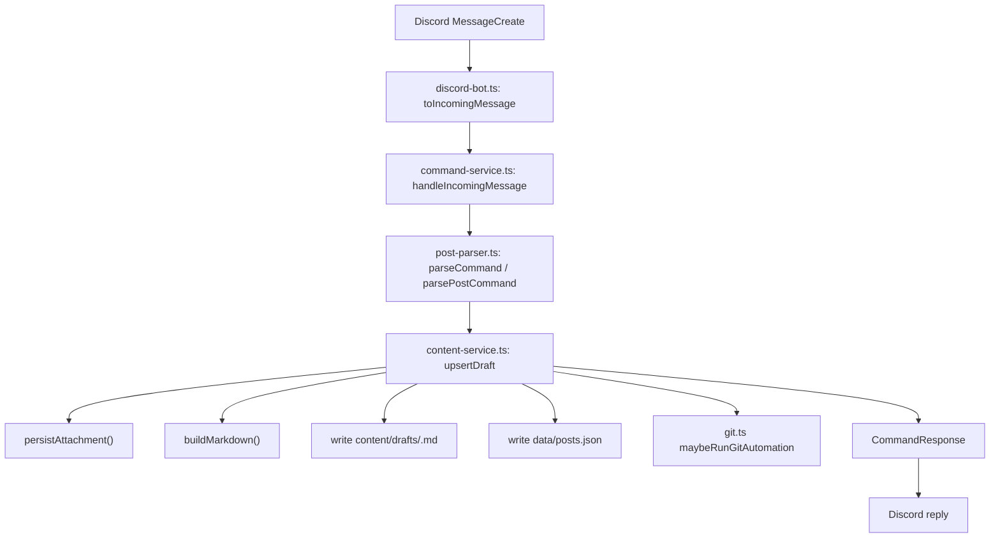
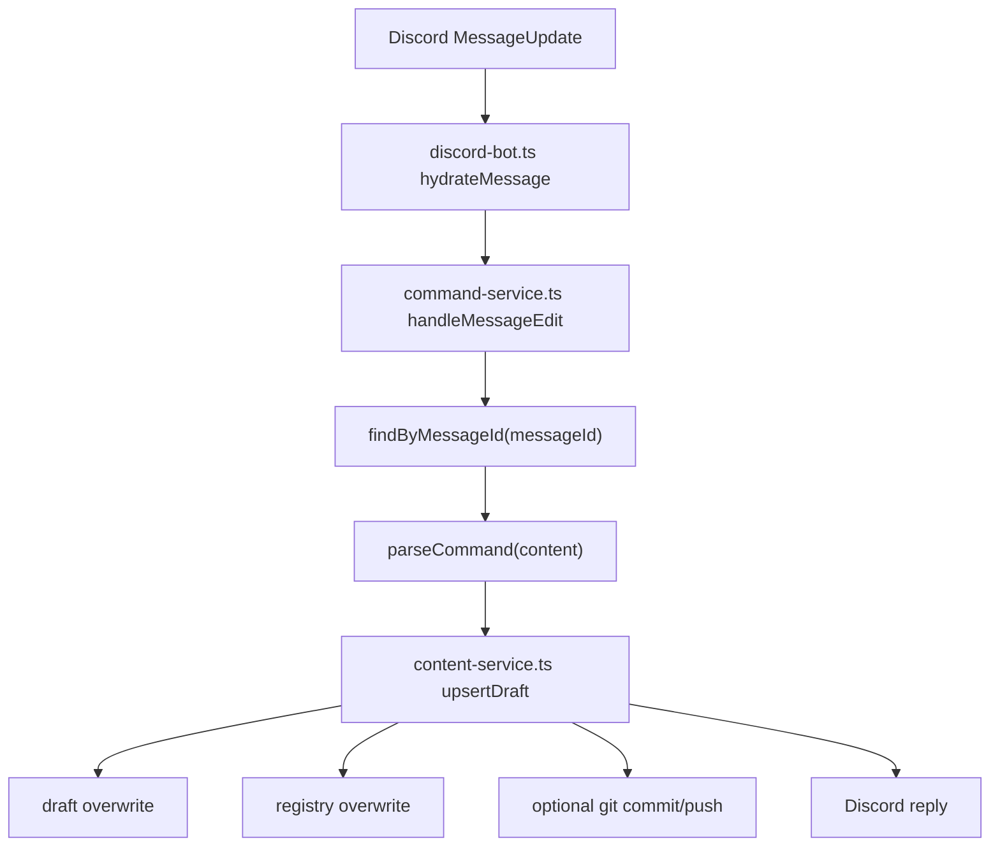
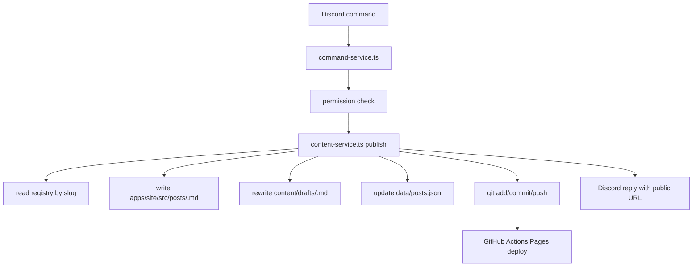

# Current Implementation Analysis

関連ドキュメント:

- [[00_overview]]
- [[02_architecture]]
- [[03_data_model]]
- [[04_roadmap]]

このドキュメントは、現時点の実装を固定的に凍結するためのメモではなく、将来も更新される「現状把握の基準点」である。  
構造、責務、運用上の痛みが変わったら、その差分を反映して更新すること。

## 1. ディレクトリ構造と責務の分解

### root

| パス | 役割 |
| --- | --- |
| `package.json` | workspace 定義と root scripts |
| `scripts/*.mjs` | build / dev / test / demo / env load / check の orchestration |
| `.github/workflows/pages.yml` | GitHub Pages deploy |
| `README.md` | 利用方法と PoC の前提 |
| `.env`, `.env.example` | 実行時設定 |
| `data/posts.json` | 投稿 registry |
| `content/drafts/*.md` | draft snapshot |

### apps/bot

| パス | 役割 |
| --- | --- |
| `src/index.ts` | bot エントリポイント |
| `src/config.ts` | env 解決とパス計算 |
| `src/discord-bot.ts` | discord.js client と event binding |
| `src/command-service.ts` | command dispatch と権限判定 |
| `src/post-parser.ts` | `!post` / `!publish` / `!status` parse |
| `src/content-service.ts` | draft / publish / unpublish の本処理 |
| `src/git.ts` | git add / commit / push |
| `src/utils.ts` | file / slug / frontmatter ユーティリティ |
| `src/types.ts` | bot 内部型定義 |
| `src/demo.ts` | Discord なしのローカル再現 CLI |
| `tests/blog-flow.test.ts` | 単体テスト |

### apps/site

| パス | 役割 |
| --- | --- |
| `astro.config.mjs` | site URL と base path の解決 |
| `src/lib/posts.ts` | `src/posts/*.md` の読み込みと正規化 |
| `src/pages/index.astro` | 記事一覧 |
| `src/pages/posts/[slug].astro` | 記事詳細 |
| `src/layouts/BaseLayout.astro` | 共通 layout |
| `src/styles/global.css` | 全体 CSS |
| `src/posts/*.md` | publish 済み記事 |
| `public/uploads/*` | 添付ファイル |

## 2. 各モジュール / ファイルの役割

### `package.json`

root script は実質的に orchestrator であり、workspace ごとの実行をまとめている。

- `dev`: bot と Astro dev server を同時起動
- `build`: bot compile + Astro build
- `test`: bot tests 実行
- `demo`: bot の demo CLI 呼び出し
- `discord:check`: Discord 実機確認前の疎通確認
- `pages:check`: Pages build 前提チェック

### `apps/bot/src/config.ts`

役割:

- `.env` から設定を解決
- repo root を探索
- draft / published / uploads / registry の絶対パスを組み立て

問題:

- path policy が config にハードコードされており、storage backend を差し替えにくい
- domain configuration と infrastructure path resolution が混在している

### `apps/bot/src/discord-bot.ts`

役割:

- Discord client 起動
- `messageCreate` / `messageUpdate` の購読
- Discord message を `IncomingMessage` へ変換
- command service の結果を Discord reply へ戻す

問題:

- reply strategy が単純で、非同期ジョブや deploy 状態の追跡に向かない
- Discord adapter が application result を単なる text としてしか扱えない

### `apps/bot/src/command-service.ts`

役割:

- channel filtering
- permission check
- parser と repository の橋渡し

問題:

- command dispatch と business policy と response 文言が混在
- `status`, `publish`, `unpublish`, `post` がすべて単一 service に集約
- use case 境界が曖昧

### `apps/bot/src/post-parser.ts`

役割:

- `!post` 本文から metadata と body を parse
- `!publish <slug>` などの slug command parse

問題:

- parser が syntax parse と validation を兼ねている
- metadata schema が暗黙で、将来フィールド追加時に fragile

### `apps/bot/src/content-service.ts`

役割:

- registry 読み書き
- slug 採番
- attachment 永続化
- Markdown 生成
- draft 保存
- publish / unpublish
- git auto commit / push 呼び出し
- status 文言生成

このファイルが現在の中核である。

問題:

- domain logic, persistence, file IO, attachment download, git integration, response shaping が一箇所に集中
- transaction boundary が存在しない
- registry 更新と file write が部分成功しうる
- attachment 更新時の差分管理がない
- publish の結果と deploy の結果が分離されていない

### `apps/bot/src/git.ts`

役割:

- `git add`
- `git commit`
- `git push`

問題:

- 失敗時の結果が呼び出し元に返らない
- stderr を握りつぶしており障害解析しづらい
- branch / remote / auth / push reject の区別がない

### `apps/site/src/lib/posts.ts`

役割:

- Astro の `import.meta.glob` で `src/posts/*.md` を eager import
- frontmatter 正規化
- list / getBySlug 提供

問題:

- content collection schema を使っていないため、frontmatter validation が弱い
- publish 済み記事の読み込みロジックが site app 内に閉じており、bot 側との schema 整合が compile-time に保証されない

### `scripts/*.mjs`

役割:

- root env load
- workspace scripts のラッパー
- 実機確認支援

問題:

- orchestration logic が scripts 側に散っている
- production startup と local dev startup が同じレイヤに存在しない

## 3. データフロー

### 3.1 `!post` 新規投稿

入力:

- Discord の message content
- attachments
- actor / roles

処理:

- parse
- slug 採番
- attachment 保存
- draft Markdown 生成
- registry 更新
- optional git commit / push

出力:

- `content/drafts/<slug>.md`
- `data/posts.json`
- `apps/site/public/uploads/...`
- Discord reply

### 3.2 既存 `!post` の編集

特徴:

- `messageId` を主キーとして追跡
- publish 済みでも draft は更新される
- publish snapshot は自動更新しない

### 3.3 `!publish <slug>`

ギャップ:

- bot は `publish` 完了を返すが、実際の public URL が live になるのは Pages deploy 後
- deploy status を追跡していないため、短時間 404 が起こりうる

### 3.4 `!unpublish <slug>`

処理:

- published Markdown を削除
- draft を `unpublished` 状態で更新
- registry 更新
- optional git commit/push

## 4. 外部依存関係

### ライブラリ

| 依存 | 用途 |
| --- | --- |
| `discord.js` | Discord Gateway / Message API |
| `astro` | 静的サイト生成 |
| `tsx` | TS 実行と watch |
| `typescript` | compile |
| `vitest` | unit test |

### 外部 API / サービス

| 外部 | 用途 |
| --- | --- |
| Discord Gateway / REST | 投稿の受信、チャンネル・ロール確認 |
| Git CLI | ローカル repo 更新 |
| GitHub Actions / Pages | 静的サイト deploy |
| Discord attachment URL | 添付ファイル download |

### 環境依存

- git CLI がローカルに存在すること
- bot 実行環境が `data/`, `content/`, `apps/site/public/uploads` に write できること
- Pages deploy では `SITE_BASE_URL` が適切に設定されていること

## 5. 現在の設計上の問題点

### 5.1 責務の混在

最も大きい問題は [`content-service.ts`](/Users/haramizuki/Project/DiscordCMS/apps/bot/src/content-service.ts) への責務集中である。

ここには本来別々であるべき次の責務が同居している。

- 投稿ワークフローの domain rule
- JSON registry persistence
- Markdown snapshot rendering
- attachment persistence
- public URL 組み立て
- git automation trigger
- user-facing response message shaping

この結果、テスト粒度が粗くなり、1 つの仕様変更が複数の関心事に波及する。

### 5.2 domain model の弱さ

現在の `RegistryPost` は storage DTO であり、業務上の概念を十分に表現していない。

不足している概念:

- publish request / publish result
- deploy state
- draft revision
- attachment lifecycle
- command execution audit

### 5.3 persistence と deployment の境界が曖昧

現状では `publish` が以下を一気に行う。

- published snapshot を書く
- registry を更新する
- git push を試みる
- public URL を返す

しかし実際には、以下は別段階である。

- local state の確定
- remote repo への反映
- Pages deploy の完了
- public web での可視化

この段階差が model に現れていないため、bot の返答がシステム実態とズレやすい。

### 5.4 file system 依存が強い

現在の core logic は path layout に強く依存している。

- draft は `content/drafts`
- live は `apps/site/src/posts`
- uploads は `apps/site/public/uploads`

この構成は PoC としては分かりやすいが、storage backend の差し替えや test fixture の抽象化に不利。

### 5.5 排他制御がない

以下の競合条件が未処理である。

- 同じ message の短時間連続 edit
- edit と publish の競合
- publish と unpublish の競合
- auto push 中の追加更新

現在は単一ユーザー・低頻度操作を前提に成立している。

### 5.6 adapter 依存の逆流

bot 入力モデル `IncomingMessage` が application core の実質的な command DTO になっており、Discord 固有の属性が domain 層に流れ込んでいる。

そのため、将来 Discord 以外の入力チャネルを追加するときに、command service の再利用性が低い。

### 5.7 観測性の不足

現状は障害時に分からないことが多い。

- git push は成功したか
- GitHub Actions deploy は始まったか
- Pages は公開完了したか
- attachment download はどこで失敗したか

log / state / user-facing status の三つが分離されていない。

## 6. 現状の構造が PoC として合理的だった理由

批判だけでなく、現状構造が妥当だった理由も明示しておく。

- file system と JSON に寄せることで実装速度を最大化できた
- Astro 側は `src/posts/*.md` を読むだけなので、publish 概念が分かりやすい
- `messageId -> slug` の単純な対応で edit tracking が成立した
- Discord なしでも demo CLI で検証できる

つまり現状は「悪い設計」ではなく、「PoC に最適化された設計」である。問題は、その構造をそのまま beta / production に延長すると限界が早く来る点にある。

次は、ゼロから設計し直すならどうするべきかを整理する。[[02_architecture]]
