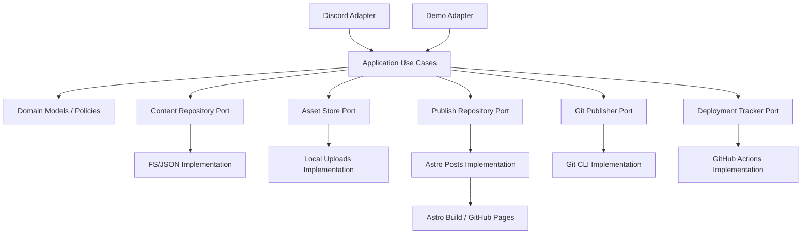
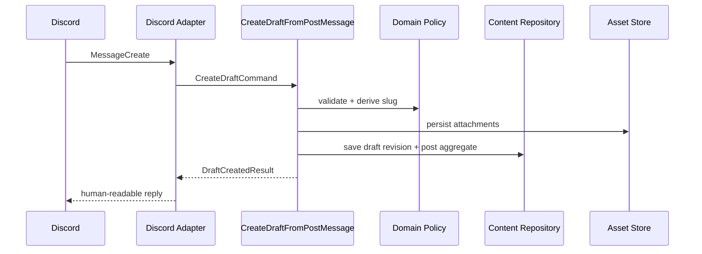
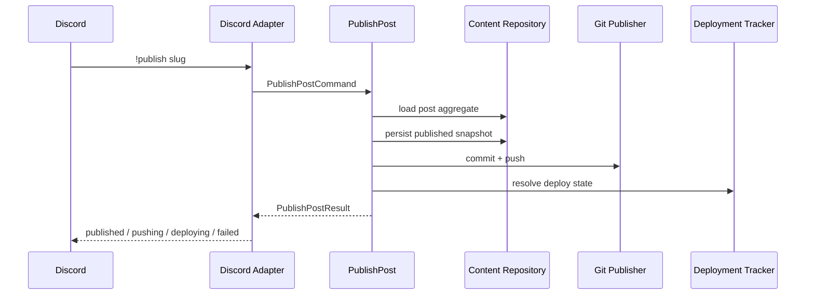

# Target Architecture

関連ドキュメント:

- [[00_overview]]
- [[01_current_analysis]]
- [[03_data_model]]
- [[04_roadmap]]

このドキュメントは、単発の理想論ではなく、将来の実装判断を揃えるための長期的な設計基準である。  
実装が進み、より良い分解や制約が見えたら、ここを更新して羅針盤の精度を上げること。

## 1. 設計の前提

この章では、「現状の延長」ではなく「ゼロから設計し直すならどうするか」という前提で構造を定義する。

制約は維持する。

- single tenant
- DB を必須にしない
- GitHub Pages を公開先として使える
- Discord を主要入力チャネルとする
- Discord なしでもローカル demo が可能

ただし、PoC とは違って次を前提にする。

- bot は常駐運用される
- publish の結果は local write と deploy 完了を区別する
- adapter を差し替え可能にする
- domain / application / infrastructure を分離する

## 2. 理想のシステム全体アーキテクチャ

### 推奨構成

```text
apps/
  bot-discord/        # Discord adapter / process entry
  site/               # Astro public site
  worker/             # optional: deploy status polling / background jobs

packages/
  domain/             # entity, value object, policy
  application/        # use case, ports, orchestration
  infrastructure/     # fs repo, git gateway, github actions gateway, discord mapper
  contracts/          # shared schema, frontmatter schema, command schema
```

### レイヤ構造



## 3. コンポーネントごとの責務

### 3.1 Adapter Layer

#### Discord Adapter

責務:

- Discord event を受け取る
- Discord 固有の payload を command DTO に変換する
- application result を Discord reply / follow-up に変換する

責務ではないもの:

- Markdown 生成
- JSON 読み書き
- Git push
- deploy status 判定

理由:

Discord は入力チャネルでしかない。アプリケーション core が Discord 依存になると、CLI demo や将来の管理 UI から再利用できない。

#### Demo Adapter

責務:

- fixture を command DTO に変換
- use case を呼ぶ
- result を console に表示

### 3.2 Application Layer

Use case 単位で分割する。

推奨 use case:

- `CreateDraftFromPostMessage`
- `UpdateDraftFromEditedMessage`
- `PublishPost`
- `UnpublishPost`
- `GetPostStatus`
- `ListRecentPosts`
- `ListDrafts`
- `RepublishPost`

各 use case の責務:

- domain rule の適用順序を決める
- repository / gateway を呼び出す
- domain event / operation result を返す

各 use case は text message を返さず、`ApplicationResult` を返すべきである。  
Discord 向けの文言化は adapter 側で行う。

### 3.3 Domain Layer

domain では次の概念を明示する。

- `Post`
- `DraftRevision`
- `PublishedSnapshot`
- `AttachmentAsset`
- `PublishState`
- `DeployState`
- `Actor`
- `PermissionPolicy`

domain layer の責務:

- slug uniqueness policy
- publish 時の state transition
- publish 済み記事編集時の `hasUnpublishedChanges`
- attachment の正当性判定
- actor の publish 権限判定

domain layer は file path, git, Discord ID fetch などを知らない。

### 3.4 Infrastructure Layer

port ごとに具体実装を置く。

#### Content Repository

役割:

- post aggregate を永続化
- storage は当面 JSON + markdown でよい

想定実装:

- `JsonPostRepository`
- `FileDraftRepository`
- `FilePublishedSnapshotRepository`

#### Asset Store

役割:

- 添付保存
- public URL 発行
- cleanup の契機管理

当面の実装:

- `LocalUploadsAssetStore`

将来候補:

- S3 / R2 / GCS

#### Git Publisher

役割:

- add / commit / push
- 実行結果を構造化して返す

#### Deployment Tracker

役割:

- GitHub Actions / Pages deploy 状態を問い合わせる
- publish 結果に `deploying` / `live` を付与する

## 4. 推奨データフロー

### `!post` 作成



### `!publish`



重要なのは、`publish` を単一の boolean success ではなく複数段階の operation result として扱うことである。

## 5. データ配置の理想

現状の file layout は PoC として妥当だが、理想形では storage 責務ごとに意味を明確化するべきである。

### 推奨 layout

```text
runtime/
  posts.json                # post aggregate store
  drafts/
    <slug>.md               # latest editable draft projection
  published/
    <slug>.md               # latest published snapshot projection
  uploads/
    YYYY/MM/*
  operations/
    <op-id>.json            # optional: publish/unpublish operation log
```

site app は `runtime/published` を直接読むのではなく、build 時に `published/` から materialize された `apps/site/src/posts` を生成するか、Astro が読むパスを専用入力ディレクトリとして切る。

理由:

- bot runtime state と site source tree を分離したい
- build input と operational store を混同しないため

## 6. 設計方針

### 方針 1: adapter 依存を外へ押し出す

Discord, git, GitHub Actions, file system は外側であり、domain / application core はそれらを直接知らない構造にする。

### 方針 2: state transition をモデル化する

`draft`, `published`, `unpublished`, `hasUnpublishedChanges`, `deploying` などは string の寄せ集めではなく、明示的な state machine として扱う。

### 方針 3: projection を分ける

単一の post aggregate と、用途別の projection を分離する。

- draft markdown projection
- published markdown projection
- public site projection

これにより、「何が source of truth か」が明確になる。

### 方針 4: 結果を構造化する

application use case は text ではなく structured result を返す。

例:

```ts
type PublishPostResult =
  | { kind: 'published_locally'; slug: string; commitSha?: string }
  | { kind: 'pushed'; slug: string; commitSha: string }
  | { kind: 'deploying'; slug: string; workflowRunUrl?: string }
  | { kind: 'failed'; reason: 'permission' | 'git' | 'deploy' | 'not_found'; detail: string };
```

### 方針 5: file system を使い続けても port を切る

DB を導入しなくても、port を切る価値は大きい。

理由:

- unit test しやすい
- migration しやすい
- local FS -> object storage へ差し替えやすい

## 7. このプロジェクトのゴールに対して合理的な構造

このプロジェクトのゴールは「CMS を作ること」ではなく「Discord を入口にした軽量なブログ運用フローを実現すること」である。  
したがって、理想構造は headless CMS のような巨大構成ではなく、次の性質を持つべきである。

- 運用 state は小さく保つ
- 公開成果物は静的である
- 入力チャネルは Discord 優先
- 失敗時の状態が分かる
- 手元でも cloud でも動く

その観点から、最も合理的なのは次の構成である。

- **Application Core**
  投稿ワークフローと state transition のみを担う
- **Discord Adapter**
  Discord 特有のイベント処理だけを担う
- **File-based Infrastructure**
  当面は JSON + markdown + local uploads を維持
- **Git Publisher**
  commit/push を責務として独立
- **Deployment Tracker**
  GitHub Pages 反映状態を追跡
- **Astro Site**
  published projection の描画に専念

現状との差分は大きいが、これは過剰設計ではない。  
PoC で既に顕在化している「publish と deploy の差」「一箇所への責務集中」「常駐運用不足」を解消するために必要十分な分解である。

詳細な model は [[03_data_model]]、移行手順は [[04_roadmap]] にまとめる。
